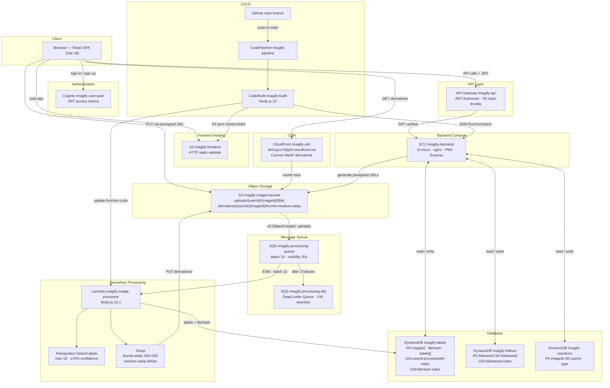

# Imagify

A Pinterest-like image sharing platform built on AWS as an end-to-end learning project covering compute, storage, serverless, queuing, CDN, auth, and CI/CD.

Upload images → AI-detected labels via Rekognition → follow users → like/dislike posts → personalised feeds → per-post engagement analytics → CloudFront-cached WebP derivatives.

**Live:** `http://imagify-frontend.s3-website-us-east-1.amazonaws.com`

---

## Architecture



---

## CI/CD Pipeline

Every push to `main` triggers the full pipeline automatically.

```
GitHub (main)
    │ CodeStar Connection
    ▼
CodePipeline imagify-pipeline
    │
    ▼
CodeBuild imagify-build (Node.js 22)
    │  npm ci (frontend)
    │  npm install (lambda — Sharp needs Linux native binary)
    │  vite build (injects Cognito + API + CDN env vars)
    │  zip lambda (includes node_modules/sharp, excludes @aws-sdk)
    │
    ├──▶ S3 sync frontend/dist → imagify-frontend
    ├──▶ Lambda update-function-code
    └──▶ SSM RunCommand on EC2 (git pull + npm ci + pm2 restart)
```

---

## Tech Stack

| Layer | Technology |
|-------|-----------|
| Frontend | React 18, Vite, React Router v6, js-sha256 |
| Frontend Hosting | AWS S3 Static Website |
| CDN | AWS CloudFront (OAC, caches WebP derivatives) |
| API Gateway | AWS API Gateway HTTP API (JWT auth, 50 req/s throttle) |
| Backend | Node.js, Express |
| Compute | AWS EC2 t2.micro (Amazon Linux 2023, nginx, PM2) |
| Storage | AWS S3 |
| Message Queue | AWS SQS (Standard queue + DLQ) |
| Database | AWS DynamoDB (on-demand, 3 tables, 4 GSIs) |
| AI / ML | AWS Rekognition DetectLabels |
| Image Processing | Sharp (WebP conversion, multi-resolution derivatives) |
| Serverless | AWS Lambda Node.js 22.x |
| Auth | AWS Cognito User Pool + `amazon-cognito-identity-js` |
| CI/CD | AWS CodePipeline + CodeBuild |

---

## Directory Structure

```
Imagify/
├── frontend/
│   └── src/
│       ├── components/
│       │   ├── Header.jsx              # Logo, search, theme toggle, user menu
│       │   ├── FeedTabs.jsx            # All / Following / My Posts tabs
│       │   ├── LabelFilter.jsx         # Scrollable label chip filter bar
│       │   ├── ImageGrid.jsx           # Responsive grid with skeleton loading
│       │   ├── ImageCard.jsx           # Card: CDN thumb + labels + reaction counts
│       │   ├── ImageDetailModal.jsx    # Full-screen: CDN medium + actions + more by owner
│       │   ├── UploadModal.jsx         # Drag-and-drop upload + post name
│       │   ├── ProgressModal.jsx       # Upload / processing / duplicate progress states
│       │   └── SkeletonCard.jsx        # Shimmer placeholder
│       ├── pages/
│       │   ├── Home.jsx                # Gallery + upload + hash-based deduplication
│       │   ├── AuthPage.jsx            # Sign up / confirm / sign in
│       │   └── ProfilePage.jsx         # Posts, Followers, Settings tabs
│       ├── services/
│       │   └── api.js                  # All backend API calls (auth-headered fetch)
│       └── utils/
│           ├── auth.js                 # Cognito SDK wrapper
│           ├── cdn.js                  # CloudFront URL builders (thumb / medium)
│           ├── labelColors.js          # Deterministic label chip colours (hash-based)
│           └── theme.js                # Light / dark / system theme (localStorage)
├── backend/
│   └── src/
│       ├── middleware/
│       │   └── auth.js                 # JWT decode → req.user.userId
│       ├── routes/
│       │   ├── images.js               # Gallery, upload-url (dedup check), labels, download, delete
│       │   ├── reactions.js            # Like / dislike
│       │   ├── follows.js              # Follow / unfollow / status
│       │   └── users.js                # Profile stats + followers list
│       └── services/
│           ├── s3.js                   # Presigned URL generation + object delete
│           ├── dynamodb.js             # Images CRUD, findByHash (dedup), download count
│           ├── reactions.js            # Reaction counts + batch delete
│           └── follows.js              # Follow/unfollow + GSI queries
├── lambda/
│   └── image-processor/
│       ├── index.js                    # SQS handler: unwrap envelope, process each record
│       ├── rekognition.js              # DetectLabels
│       ├── imageResizer.js             # Sharp derivatives + SHA-256 hash
│       └── dynamodb.js                 # Write labels + fileHash to imagify-labels
└── buildspec.yml                       # CodeBuild: build + deploy all 3 targets
```

---

## API Endpoints

All routes require `Authorization: Bearer <cognito-access-token>`. Token signature verified by API Gateway before reaching EC2.

### Images
| Method | Path | Description |
|--------|------|-------------|
| `GET` | `/api/images` | Gallery — `?feed=global\|following\|mine` |
| `GET` | `/api/images/upload-url` | Presigned S3 PUT URL (dedup check via `?fileHash=`) |
| `GET` | `/api/images/:id/labels` | Poll for Rekognition labels |
| `POST` | `/api/images/:id/download` | Record download (increments count) |
| `DELETE` | `/api/images/:id` | Delete (owner only) — S3 + DynamoDB + reactions |

### Reactions
| Method | Path | Description |
|--------|------|-------------|
| `PUT` | `/api/images/:id/reactions` | Like or dislike `{ type: "like"\|"dislike" }` |
| `DELETE` | `/api/images/:id/reactions` | Remove reaction |
| `GET` | `/api/images/:id/reactions` | Counts + current user's reaction |

### Follows
| Method | Path | Description |
|--------|------|-------------|
| `PUT` | `/api/follows/:userId` | Follow a user |
| `DELETE` | `/api/follows/:userId` | Unfollow a user |
| `GET` | `/api/follows/:userId` | Follow status + follower count |

### Users
| Method | Path | Description |
|--------|------|-------------|
| `GET` | `/api/users/:userId` | Profile stats (postCount, followerCount, followingCount, isFollowing) + images |
| `GET` | `/api/users/:userId/followers` | List of follower userIds |

---

## Upload Flow

```
1. Frontend computes SHA-256 of file (js-sha256, works on HTTP + HTTPS)
2. GET /api/images/upload-url?fileHash=<hash>
       └─ duplicate found → { duplicate: true } → "Already in your gallery"
       └─ not found      → { uploadUrl, imageId }
3. Browser PUTs file directly to S3 (presigned URL — no EC2 bandwidth)
4. S3 ObjectCreated event → SQS imagify-processing-queue
5. Lambda (batch up to 10):
       ├─ Rekognition DetectLabels (max 10, ≥70% confidence)
       ├─ Sharp → thumb.webp (200×200) + medium.webp (800px) → derivatives/
       └─ DynamoDB ← labels + fileHash + processedAt
6. Frontend polls /api/images/:id/labels every 2s (up to 40s)
7. Gallery refreshes — CDN serves thumb from CloudFront, modal serves medium
```

---

## Image Serving

| Context | Source | URL |
|---------|--------|-----|
| Grid card | `thumb.webp` (200×200) | CloudFront `/derivatives/{userId}/{imageId}/thumb.webp` |
| Detail modal | `medium.webp` (800px) | CloudFront `/derivatives/{userId}/{imageId}/medium.webp` |
| Download | Original file | S3 presigned URL (60 min TTL) |
| Fallback (old images) | Original file | S3 presigned URL (on CDN 404) |

---

## Local Development

```bash
# Backend
cd backend && npm install && npm run dev   # http://localhost:3000

# Frontend (separate terminal)
cd frontend && npm install && npm run dev  # http://localhost:5173 — proxies /api → :3000
```

**`backend/.env`** (gitignored):
```
AWS_ACCESS_KEY_ID=...
AWS_SECRET_ACCESS_KEY=...
COGNITO_USER_POOL_ID=us-east-1_Gkon7tum6
COGNITO_CLIENT_ID=7ctfdoq4bmcrkgnfofnovh1a2g
DYNAMODB_TABLE_NAME=imagify-labels
S3_BUCKET_NAME=imagify-images-bucket
FOLLOWS_TABLE_NAME=imagify-follows
REACTIONS_TABLE_NAME=imagify-reactions
```

**`frontend/.env.local`** (gitignored):
```
VITE_COGNITO_USER_POOL_ID=us-east-1_Gkon7tum6
VITE_COGNITO_CLIENT_ID=7ctfdoq4bmcrkgnfofnovh1a2g
```

`VITE_API_URL` is omitted — Vite proxies `/api` → `localhost:3000`. `VITE_CDN_URL` is omitted — CDN utils return `null` and fall back to presigned URLs for local dev.

---

## AWS Infrastructure

All resources in `us-east-1`.

| Resource | Name | Notes |
|----------|------|-------|
| S3 | `imagify-images-bucket` | Private; originals + derivatives; CloudFront OAC |
| S3 | `imagify-frontend` | Public static website hosting |
| S3 | `imagify-pipeline-artifact` | CodePipeline artifacts |
| DynamoDB | `imagify-labels` | PK:imageId; GSI:userId-processedAt; GSI:fileHash-index |
| DynamoDB | `imagify-follows` | PK:followerId SK:followeeId; GSI:followeeId-index |
| DynamoDB | `imagify-reactions` | PK:imageId SK:userId |
| SQS | `imagify-processing-queue` | Standard; batch 10; visibility 30s; DLQ after 3 failures |
| SQS | `imagify-processing-dlq` | Dead letter queue; 14d retention |
| Lambda | `imagify-image-processor` | Node.js 22.x; SQS ESM trigger; 512MB; 30s timeout |
| CloudFront | `imagify-cdn` | `d42cq1u765phf.cloudfront.net`; origin: images bucket via OAC |
| EC2 | `imagify-backend` | t2.micro; Amazon Linux 2023; nginx + PM2 |
| API Gateway | `imagify-api` | HTTP API; JWT authorizer; 50 req/s burst 100 |
| Cognito | `imagify-user-pool` | Email sign-up/in; ID: `us-east-1_Gkon7tum6` |
| IAM Role | `imagify-lambda-role` | S3 read+write, Rekognition, DynamoDB write, SQS consume |
| IAM Role | `imagify-ec2-role` | S3 presigned URLs, DynamoDB full, SSM |
| IAM Role | `imagify-codebuild-role` | S3 sync, Lambda update, SSM send |
| IAM User | `imagify-local-dev` | Local development credentials |
| CodePipeline | `imagify-pipeline` | Triggered on push to `main` |
| CodeBuild | `imagify-build` | Node.js 22; env vars injected at build time |
| GitHub Connection | `imagify-github` | CodeStar Connection |
